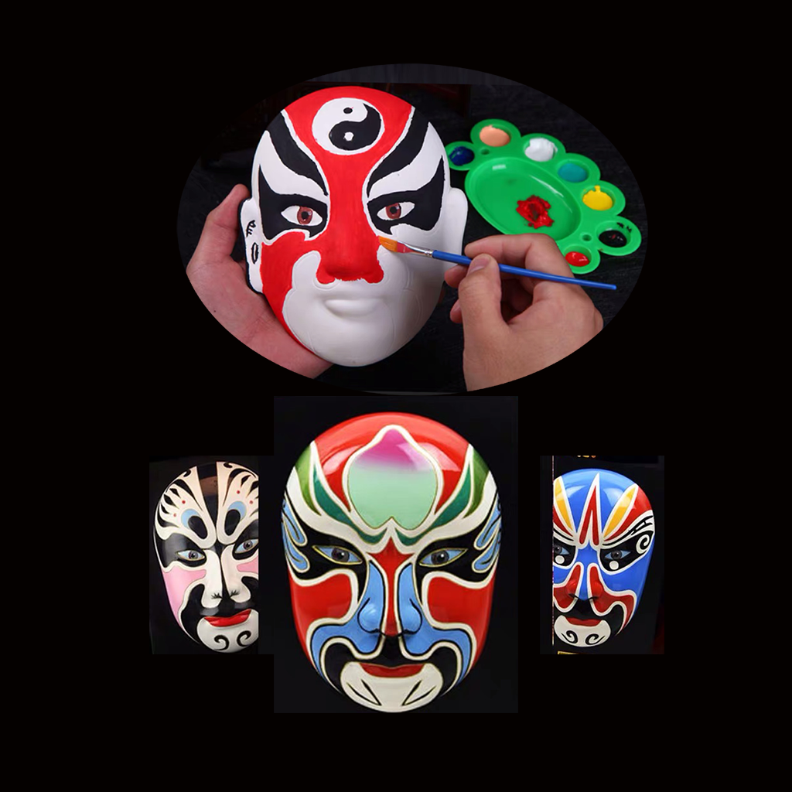

## 欢迎来到 我的戏曲脸谱DIY手绘练习

脸谱是我国独特的一种绘画艺术，在古装戏曲中，主要指净角用各种色彩在脸上勾画一定的图案，形成演员面部一种特定的谱式。喜欢戏曲脸谱的人常常会自己绘制独特的脸谱，如果你也喜欢脸谱，你可以利用这个工具帮助你练习和理解戏曲脸谱的艺术。你可以记录每次绘制脸谱的类别，比如秦腔脸谱、耿家脸谱等不同特点风格和形象特点，帮助你练习和体会不同谱式的美感和文化寓意。

如果您遇到什么需要解答的问题，请发送您的问题到以下邮箱。

我们将第一时间为您解答。

### 邮箱地址: zhanghesongyuan7@126.com

谢谢！
